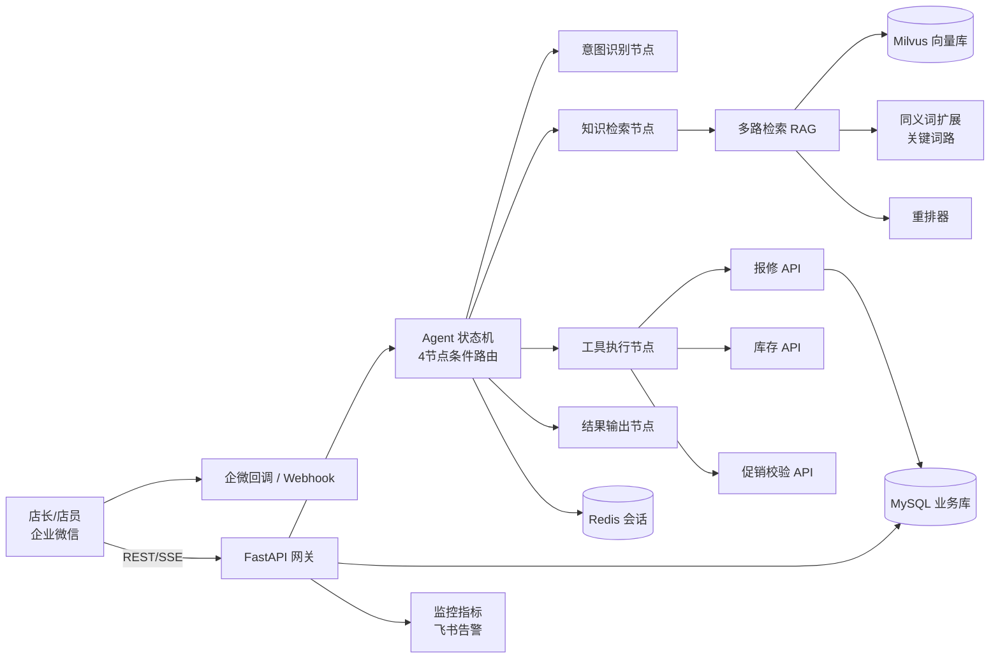

# 连锁门店运营智能助手 Agent 系统 —— 设计文档

## 1. 系统架构

## 2. 核心设计决策

### 2.1 为什么用状态机而不是线性 Chain
- 需求里存在**会话中意图切换**（报修一半改问库存）、**步骤回退**（工具失败降级检索）、
  **多轮工具调用链**（ReAct 循环）——这些是图结构而非线性链；
- 状态机把节点与路由显式化，便于测试单个节点、回放失败会话；
- 双模式执行：在线走 LangGraph StateGraph，离线/异常降级自研手动执行器。

### 2.2 RAG 为什么多路检索而不是单路向量
- 门店文档口语化严重（"还有多少"、"坏了"），纯向量检索对短查询、低频词召回差；
- 方案：向量路（语义）+ 同义词扩展关键词路（精确），RRF 融合 → 重排 → Top-3；
- 重排采用 0.5*召回分 + 0.35*关键词命中 + 0.15*类别加分，在线可切 bge-reranker。

### 2.3 结构化分块策略
- 文档按「问题类别 + 操作步骤 + 注意事项」解析，Chunk 携带结构化元数据；
- 类别元数据同时用于**意图路由后的检索过滤**，提升 Top-3 命中率。

### 2.4 工具调用与降级
- 3 个内部 API 工具均提供 Function Calling Schema（LLM 自主调用）与规则路由（离线兜底）；
- 工具失败（门店号无效/物料不存在）→ **降级返回知识库检索方案**，不让用户空手而归；
- 超范围问题 → 汇总上下文转人工（handoff_summary 供人工接续）。

### 2.5 基础设施降级策略（可观测性）
| 组件 | 生产 | 本地演示 | 切换方式 |
|---|---|---|---|
| 向量库 | Milvus (IP 检索) | 内存向量库 + index.json | 连接失败自动降级 |
| 会话 | Redis | 内存 dict | 连接失败自动降级 |
| 持久化 | MySQL | SQLite | 连接失败自动降级 |
| LLM | DeepSeek V3 | 规则引擎（全流程可跑） | 无 Key 自动降级 |

### 2.6 效果度量体系
| 指标 | 计算方式 | 目标 |
|---|---|---|
| Top-3 召回率 | ground truth 文档是否进入检索 Top-3 | 82% |
| 意图准确率 | 意图识别 vs 标注 | ≥90% |
| 工具调用准确率 | 工具类用例调用期望工具比例 | ≥95% |
| 任务完成率 | 工具成功 + 回答产出 | ≥90% |
| 幻觉率 | 回答与上下文重合度低于阈值占比（离线近似） | ≤5% |

## 3. 接口一览
| 方法 | 路径 | 说明 |
|---|---|---|
| POST | /api/chat | REST 对话（JSON） |
| POST | /api/chat/stream | SSE 流式（intent→retrieval/tool→answer_delta→done） |
| GET | /api/session/{sid} | 会话历史 |
| POST | /api/retrieve | 检索调试 |
| GET/POST | /wecom/callback | 企微验签 + 消息回调 |
| GET | /healthz | 健康检查（含各组件降级状态） |
| GET | /metrics | Prometheus 文本指标 |
